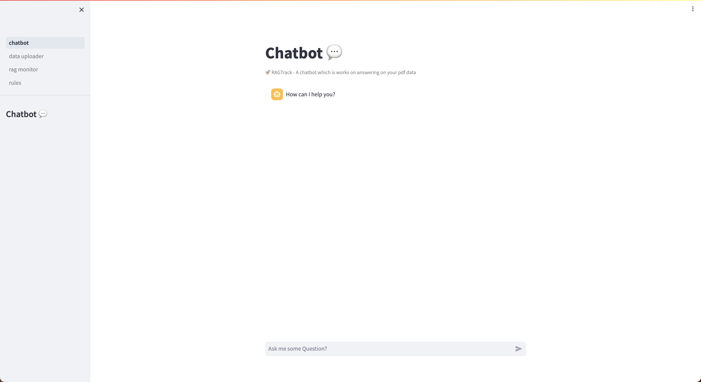
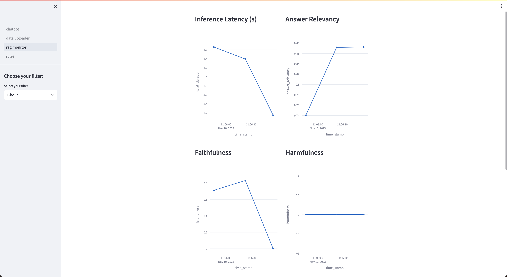

# RAGTrack: AWS-Powered Context-Aware QA Bot with Quality Monitoring capabilities

## Introduction
RAGTrack is a context aware QA bot built upon Llama2 with Quality Monitoring capabilties. The framework includes the component to ingest pdf data into vectordb, Inference with the QA bot through in-context learning, Quality monitoring of the RAG (Retreival Augmented Generation) pipeline against a Judge Model Claude v2. All of the foundational models are configured to use Amazon Bedrock. Additionally, we offer the capability to also infer from local models or using Amazon Sagemaker endpoint.  

## Project Structure
```
nc-bot
|
|----- pages
|----- pg_vector
|----- scripts
|----- rag_application_framework
        |----- config
        |----- helpers
        |----- models
        |----- handlers
|----- chatbot.py
|----- docker-compose-postgres.yml
|----- docker-compose.yml
|----- Dockerfile
|----- Makefile
|----- requirements.txt
|----- .env.template
```

The project is structure as shown above. The important modules are the rag_application_framework/handlers/ragas_evaluation_and_db_logging_callback_handler.py which includes the callback handling of the RAG pipeline to perform the evaluation and saving the scores in the RagScore Table. The helpers module contain all the necessary helpers for ingestion, inference, and evaluation.  

## Setup the bot locally
We can also setup the local via docker. For this one must do the following activities and we assume that docker is setup already in the machine.  

First setup the .env required for the application. In order to do so, perform the necessary steps:  
1. Copy the .env.template as .env and fill in the following values in accordance as shown in the table:  

| KEY                 | VALUE       | Description                                                                                   |
|---------------------|-------------|-----------------------------------------------------------------------------------------------|
| AWS_PROFILE         | AWS_PROFILE | AWS profile                                                                                   |
| AWS_REGION          | AWS_REGION  | AWS region                                                                                    |
| DB_LOCAL         | true,false  | Use Local database or from AWS                                                                |
| PGVECTOR_DATABASE   | dbname      | db name to use vectordblab                                                                    |
| PGVECTOR_USER       | postgres    | postgres                                                                                      |
| PGVECTOR_PASSWORD   | pwd         | set a password                                                                                |
| PGVECTOR_PORT       | 5432        | 5432                                                                                          |
| PGVECTOR_HOST       | postgres    | localhost/service_name                                                                                    |
| SAGEMAKER_ENDPOINT_SSM_PARAM_NAME    | ssm_param   | Optional: SSM parameter store name for Sagemaker endpoint created from CDK if using Sagemaker |
| RDS_POSTRGRES_CREDENTIALS_SECRET_NAME     | SecretName  | Optional: RDS Secret name for created from CDK if using RDS and IS_LOCAL_DB is false          |
| OPENAI_API_KEY_SECRET_NAME | token       | Required to use evaluation of the RAG pipeline using ragas                                    |
| BUCKET_NAME         | bucket_name | S3 bucket name to be created to store the pdf data and reference                              |
| USE_BEDROCK_EMBEDDINGS         | true,false  | Either to use aws titan embeddings or not                                                     |
| BEDROCK_EMBEDDINGS_REGION      | region      | Region of the aws bedrock model                                                               |

2. Create the virtual environment with `python3 -m venv .venv` and install the pip requirements with `pip install -r requirements.txt`  

3. Build and start the postgres local image containing the pgvector extension with the following steps:  
```
# Build the docker image
cd genai-aws/nc-bot
docker build -t pgvector_local -f pg_vector/Dockerfile .

Run:
# If the app is deployed through docker-compose then run:
docker run \
    --network backend-network --network-alias postgres \
    --name postgresql-container \
    -p 5432:5432 \
    -e POSTGRES_PASSWORD=test \
    -d pgvector_local

# If using the database independently then run:
docker run \
    --name postgresql-container \
    -p 5432:5432 \
    -e POSTGRES_PASSWORD=test \
    -d pgvector_local
# Refer nc-bot/pg_vector/run_pg_local.txt for more details on the execution.  
```
This should start a local postgres container with pgvector extension installed. Note: One can change the underlying vectordb to another. To verify if everything is alright just login to pgadmin docker container at `http://localhost:5555` and access the database by setting up new connection with the details with username as postgres, password as one you define during the run command as shown above. Note: The host will be service name while using application also deployed through docker otherwise localhost should be fine.    

4. Next, since the database is setup update the .env with the values for the database and setting `DB_LOCAL` to true.  Note: While using chatbot locally on your laptop set the `PGVECTOR_HOST`` as localhost.  

5. Download and install ollama (https://ollama.ai/)[Ollama] and pull llama2 for 7b or 13b. Note: You can also play around with some other model. You will need a laptop that is atleast quite high in configurations with multicore and about 16 to 32 GB of RAM.  
```
ollama pull llama2:7b|13b
ollama run llama2:7b|13b
/bye
```
When instead if using Amazon Bedrock Service then it can directly be configured in the environment variables.  
5. Run the app locally within your laptop:  
```
# Run the application locally
```
cd genai-aws/nc-bot
$streamlit run chatbot.py
```
6. Open `http://localhost:8501`. It should launch our home page.  


7. After some queries, you can see that the quality monitoring has started to kick in to monitoring the RAG pipeline.  


## Setup for AWS deployment  
We have CDK stack to deploy the components into the AWS infrastructure including the foundational models that could be from Sagemaker or Huggingface. The docker image for the application itself needs to be built and uploaded into ecr for the account. This will then be referenced within the cdk.json. For the creation of the docker image, reference `nc-bot/build_docker_image.txt` and the script at `nc-bot/scripts/build_and_push_docker.sh` for more details.  